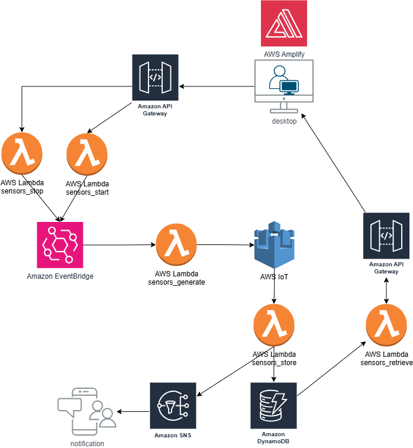

# 🚀 Remote Equipment Monitoring System (Cloud-Integrated SCADA)
**Try the Live Demo Here** 👉 [https://main.da3mnmg18wb1q.amplifyapp.com/](https://main.da3mnmg18wb1q.amplifyapp.com/)

## Overview
The Remote Equipment Monitoring System is a cloud-integrated SCADA (Supervisory Control and Data Acquisition) system that enables real-time monitoring of industrial equipment using AWS services.
This project demonstrates the integration of **AWS IoT Core, DynamoDB, API Gateway, Lambda, EventBridge, and SNS** to collect, process, and visualize equipment data.

This project showcases:
- **AWS-based Industrial IoT (IIoT) monitoring** for real-time equipment status tracking.
- **Serverless architecture** to optimize scalability and cost efficiency.
- **Data-driven alert system** using AWS SNS for proactive notifications.
---
## Tech Stack & AWS Services Used
**Frontend**:
- **Next.js (TypeScript)** - Web dashboard for real-time data visualization.
- **Tailwind CSS** - Modern UI styling.
- **React Hooks** - For state and data fetching logic.
**Backend**:
- **AWS IoT Core** - Secure and scalable MQTT-based data transmission.
- **AWS Lambda** - Serverless backend functions for data processing.
- **AWS DynamoDB** - NoSQL database for storing historical equipment data.
- **AWS API Gateway** - Secure REST API for frontend-backend communication.
- **AWS SNS** - Sends email alerts for critical equipment issues.
- **AWS EventBridge** - Triggers automated data generation every minute.
---
## Features
- **Real-Time Equipment Monitoring**:
  - Retrieves and displays live sensor data (temperature, pressure, humidity). (lambda function used to demonstrate instead of actual sensors)
  - Uses AWS IoT Core to publish sensor data to the cloud.
- **Web Dashboard for Data Visualization**:
  - Built using Next.js + Tailwind CSS for a clean and responsive UI.
  - Displays equipment data dynamically using an auto-refresh feature.
- **Automated Data Storage & Retrieval**:
  - Stores sensor data in AWS DynamoDB.
  - Uses Lambda functions to fetch and return the latest data via API Gateway.
- **Alert & Notification System**:
  - Triggers alerts when temperature exceeds 80°C.
  - Sends email notifications using AWS SNS.
- **Scheduled Data Generation (Testing Mode)**:
  - Uses AWS EventBridge to trigger a Lambda function every minute.
  - Simulates real-time sensor data in AWS IoT Core.
- **Start/Stop Equipment Simulation**:
  - Users can start/stop simulated sensor data generation via the web dashboard for testing purpose.
  - Uses API Gateway & Lambda to dynamically enable/disable EventBridge rules.
---
## Architecture Overview

---
## Future Improvements
- Security Practice
  - Implemented AWS Cognito authentication
- Machine Learning for Predictive Maintenance
  - Integrate AI/ML models to predict equipment failures before they occur.
- Mobile App for Equipment Monitoring
  - Extend the monitoring dashboard to React Native for mobile users.
